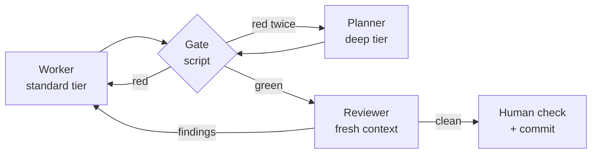

# Review loop (optional)

An agent reviewing its own work in the same context mostly confirms what it already believes. The loop below makes
review independent and makes the feedback reach the implementer.


```mermaid
flowchart LR
  W[Worker<br/>standard tier] --> G{Gate<br/>script}
  G -- red --> W
  G -- red twice --> P[Planner<br/>deep tier]
  G -- green --> R[Reviewer<br/>fresh context]
  R -- findings --> W
  R -- clean --> H[Human check<br/>+ commit]
  P --> G
```

## Steps

1. **Worker** implements one task and runs the gate. It reports the exit code and any failing output verbatim. It
   never reports success without a green gate. **Workers never commit.**
2. **Freeze the diff:** save it to a patch file (`git diff > /tmp/<feature>-task-N.patch`) so later edits don't blur
   what was reviewed.
3. **Reviewer** starts in a **fresh context** (a new session or sub-agent) with only the patch, the feature spec and
   the project rules. It reports real issues only, each with `file:line` and a severity. It does not edit code.
   Security-sensitive paths (auth, crypto, input validation, permissions) get the deep tier.
4. **Findings go back to the same worker** for one retry. After a second red gate or a disputed finding,
   escalate to the planner (deep) with the spec, the diff and both outputs.
5. **Human check:** rerun the gate yourself (and the UI in a real browser when the change is visual), read the
   reviewer's verdict table, then commit. Check the change's `Deploy impact:` line: if it is not `none`, the people who
   run CI/CD hear before the merge. A job that runs from the default branch picks up every merge on its next run.

## Reviewer prompt (works with any agent)

```text
Review ONLY the change in <patch file> against <.specs/features/<feature>/> and the project rules in AGENTS.md.
Check: every changed behaviour traces to a REQ; acceptance criteria are actually tested; nothing outside the
task's scope; spec docs updated per .specs/kit/playbooks/sync.md; error paths and edge cases; security.
Output a table: severity (blocker/major/minor) | file:line | issue | suggested fix.
Report real issues only. No style nits the linter already covers. Do not edit files.
```

## Running parallel workers safely

- Never run two workers on the same files at once.
- Two workers sharing one checkout must not use `git stash`, `reset`, `checkout` or `restore`: one worker's
  stash wipes the other's edits. Give each its own `git worktree`, or read old code with `git show HEAD:path`.

## Grill the artifact (optional, before implementation)

A spec or plan is cheapest to fix before code exists. For a large or risky one, attack the document instead of
waiting for the code review to find its gaps.

1. **Independent reviewers.** Start two or more reviewers in fresh contexts, each with the artifact, the project rules
   and read access to the code. Give each a different angle (correctness, security, operations, scope).
2. **Questions with a recommended answer.** Each reviewer lists the questions the artifact leaves open or gets wrong.
   For each it writes the answer it recommends, then tries to refute that answer with evidence: `path:line`, a command
   and its output, a test. An answer that survives goes in; one that doesn't is replaced or becomes an open question.
3. **Rounds until clean.** Fix the artifact and run a new round with fresh reviewers. Stop when a round finds nothing
   material: no wrong claim, no missing requirement, no contradiction. Style is not material.
4. **Settled answers go into the decisions log.** Each becomes a row in `.specs/steering/decisions.md` with its reason
   and where it lands, and the REQs it governs cite it. From then on it is cited, not argued again. A changed mind is a
   new dated row that supersedes the old one.
5. **Ask the human only what is theirs.** Product, risk, client and budget calls go to the human, with the options and
   the recommended one. Questions the code, the docs or a test can answer never go to the human.

Reviewer prompt:

```text
Grill <artifact> against the code and the project rules in AGENTS.md. Angle: <correctness | security | operations | scope>.
List every claim that is wrong or unsupported, every missing requirement and every contradiction. For each, give your
recommended answer, then try to refute it with evidence (path:line, a command and its output, a test) and say whether
it survived. Mark the ones only the human can decide, and why. Report material issues only. Do not edit files.
```
